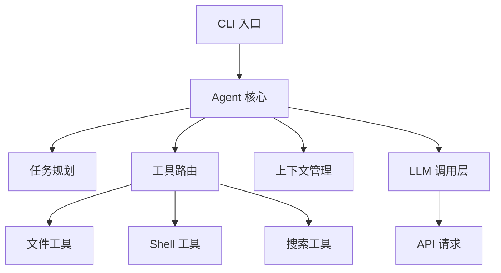
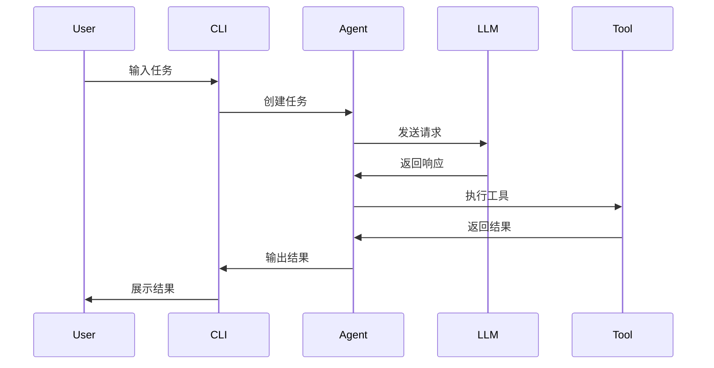
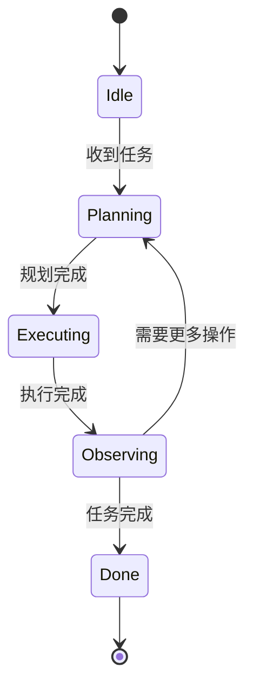

# LangChain 源码深度研究提示词（完整优化版）

> **版本**: 完整优化版  
> **创建时间**: 2026-03-11  
> **原始作者**: 杜群  
> **优化补充**: Joy (OpenClaw AI Assistant)

---

## 🎯 核心角色设定

希望你扮演一位 **"资深 Agent 系统架构师 + 资深 AI 工程师 + 资深代码研究员"**，帮助我系统性研究一个 GitHub 项目，目标不是简单总结代码，而是要通过深入的源码分析，帮助我真正理解该项目背后的 Agent 设计思想、工程实现方式、调用机制，以及这些思想如何迁移到我自己的 Agent demo 项目中。

---

## 📋 研究对象与目标

### 研究对象
**LangChain**（或相关仓库 / 代码片段 / 模块）

### 研究目标
1. 全面理解该项目的整体架构与模块边界
2. 理解其中 Agent 的核心设计思想
3. 理解任务是如何被分解、规划、执行、反馈、修正的
4. 理解模型调用、工具调用、上下文管理、状态管理、记忆管理、错误恢复、权限控制、安全机制是如何设计的
5. 理解它如何服务于真实的软件开发工作流（如读代码、改代码、执行命令、编辑文件、生成计划、调用工具等）
6. 提炼出可以复用于我自己项目的工程模式、抽象接口、设计范式
7. 最终帮助我设计一个简化版 Agent demo

---

## 📝 输出要求

请你按"研究报告"的方式输出，**不要泛泛而谈，不要只做表面总结**。请基于代码结构、模块职责、调用链、关键函数、数据流、控制流、状态流进行深入分析。

---

## 📚 研究框架（正文）

---

# 1. 项目全景概览

- 这个项目的核心目标是什么？
- 它解决的核心问题是什么？
- 它在整个 AI Coding Agent / CLI Agent / Developer Tooling 生态中的定位是什么？
- 如果把它抽象成一个系统，它由哪些一级模块组成？

---

# 2. 架构分层分析

请从架构角度拆解整个项目，至少覆盖：

- **表现层 / 交互层**（CLI、UI、命令入口、用户输入处理）
- **Agent Orchestration 层**（任务编排、决策、规划、状态推进）
- **Tool Use 层**（工具注册、工具选择、工具调用、结果回传）
- **LLM Interaction 层**（Prompt 构造、模型请求、模型响应解析、重试机制）
- **Context / Memory 层**（上下文注入、会话状态、历史管理、记忆裁剪）
- **Execution 层**（命令执行、文件读写、代码修改、补丁应用）
- **Safety / Guardrail 层**（权限控制、危险命令限制、人工确认、安全策略）
- **Observability 层**（日志、调试、trace、事件流）

### 对于每一层，请说明：
- 该层的职责
- 涉及的核心模块 / 文件 / 类 / 函数
- 与上下游层之间如何交互
- 为什么要这样分层
- 这种分层的优点和潜在缺点

---

# 3. 核心 Agent 运行流程

请用"一个用户提出 coding 任务"为例，详细追踪一次完整调用链：

- 用户输入如何进入系统
- 如何被解析为任务
- 是否存在 planner / executor / reviewer / tool router 等角色
- 模型何时被调用
- 工具何时被调用
- 工具结果如何回流到上下文
- 如何决定下一步行动
- 如何结束任务或进入循环
- 如何处理中断、失败、重试、澄清

### 请尽量给出：
- 关键函数调用链
- 关键数据结构
- 状态变化过程
- 时序图式的文字说明

---

# 4. Agent 设计思想拆解

请重点分析该项目体现了哪些 Agent 设计思想，例如但不限于：

- ReAct
- Plan-and-Execute
- Toolformer / Tool-use style
- Reflection / Self-correction
- Human-in-the-loop
- Memory-based agent
- Event-driven agent
- Multi-step task decomposition
- Environment grounding
- Action-policy separation

### 请回答：
- 这些思想在代码中分别体现在哪里？
- 是显式实现还是隐式实现？
- 哪些是设计文档层面的理念，哪些真正落到了工程代码中？
- 它与一个简单"LLM + 工具调用脚本"的本质差异是什么？

---

# 5. Prompt / Context Engineering 分析

请从源码角度分析：

- 系统提示词 / 开发者提示词 / 工具提示词是否存在
- Prompt 模板如何组织
- 上下文拼接策略是什么
- 历史消息如何保留、裁剪、压缩
- 文件内容、代码片段、命令输出如何注入上下文
- 如何降低幻觉并提升代码任务准确率
- 是否有针对不同工具或不同任务类型的提示词分化策略

**如果代码里没有明确写出 prompt，也请根据调用方式推断其 prompt engineering 思路。**

---

# 6. Tool Use 机制深挖

请重点研究工具机制：

- 有哪些工具类别（文件、shell、搜索、diff、测试、Git、网络等）
- 工具是如何抽象的（接口、协议、schema、注册机制）
- 模型是如何知道有哪些工具可以用的
- 工具调用参数如何约束与校验
- 工具执行结果如何格式化返回给模型
- 如何处理工具错误
- 如何避免工具滥用和危险操作
- 工具机制是否具备可扩展性，如何新增一个工具

**最后请总结该项目的 tool-use 设计范式。**

---

# 7. 状态管理与记忆机制

请分析：

- 系统是否有显式状态机
- 任务状态如何保存
- 会话状态如何保存
- 是否区分短期上下文与长期记忆
- 是否存在 checkpoint / resume / recovery
- 当上下文窗口不足时如何处理
- 是否有针对 coding task 的特殊状态表示（如当前文件、工作目录、改动集、待办计划）

---

# 8. 软件工程实现质量评估

请从工程角度评价该项目：

- 模块边界是否清晰
- 抽象是否合理
- 耦合度如何
- 可测试性如何
- 可扩展性如何
- 哪些部分是"Agent 研究价值高"的
- 哪些部分只是"产品工程胶水代码"
- 哪些部分最值得我模仿

### 请同时指出：
- 该项目最优雅的 3 个设计点
- 最可能有技术债的 3 个地方
- 如果让我重构，你会优先改哪里，为什么

---

# 9. 面向复现的知识提炼

请把这个项目提炼成"我自己实现一个简化版 coding agent demo"时最需要的知识清单：

- 必须保留的核心能力
- 可以简化掉的复杂能力
- 建议我先实现的最小闭环
- 推荐的模块拆分
- 推荐的接口设计
- 推荐的数据结构
- 推荐的开发顺序

### 请输出一个：
- MVP 版本架构图（文字描述即可）
- 模块清单
- 开发路线图（按优先级排序）
- 每一步的验收标准

---

# 10. 研究结论

最后请总结：

1. LangChain 这类系统的核心竞争力到底是什么？
2. 它的 Agent 性体现在哪里？
3. 它对我自己做 Agent demo 最值得借鉴的 10 条经验是什么？
4. 如果我要继续深入研究，下一步最该读哪些文件 / 模块 / 调用链？

---

## ⚠️ 额外要求（原文）

- 不要只讲概念，必须尽量结合源码结构来分析
- 如果信息不足，请明确说明"基于现有代码我能确认的"和"我推测的"
- 尽量给出模块、文件、类、函数、调用关系
- 输出要偏"技术研究报告"，而不是营销式介绍
- 如果代码很多，请先给研究地图，再给优先级最高的分析路径
- 如果适合，请给出 mermaid 风格的流程图 / 架构图（文字形式也可以）

---

---
---

# 📌 优化补充（由 Joy 添加）

> 以下是对原始提示词的优化补充，不影响原始内容，可根据需要选用。

---

## 🔧 补充 1：研究前置信息配置

建议在开始研究前，先填写以下信息：

```markdown
## 研究前置信息

### 仓库信息
- 项目名称：LangChain
- 仓库地址：https://github.com/anthropics/claude-code
- 目标版本/Commit：[请指定]
- 本地路径：[如已克隆]
- 研究日期：YYYY-MM-DD

### 研究配置
- 时间预算：[ ] 30分钟  [ ] 2小时  [ ] 1天
- 分析模式：[ ] 快速  [ ] 标准  [ ] 深度
- 输出语言：中文
```

### 分析模式说明
| 模式 | 时长 | 输出章节 | 适用场景 |
|------|------|---------|---------|
| 快速 | 30分钟 | 1、2、3、9、10 | 快速了解架构，提炼 MVP |
| 标准 | 2小时 | 1-6、9、10 | 全面理解核心，掌握设计 |
| 深度 | 1天 | 全部章节 | 深度研究，准备复现 |

---

## 🔧 补充 2：渐进式输出控制

如果研究内容较长，建议采用渐进式输出：

```
第一次输出：研究地图 + 第1-3章
第二次输出：第4-6章
第三次输出：第7-9章
第四次输出：第10章 + 研究结论
```

**每章建议控制在 2000-3000 字以内**

---

## 🔧 补充 3：代码引用格式规范

建议统一代码引用格式：

```
格式规范：
- 文件路径：`src/agent/core.ts`
- 函数/类：`Agent.run()` 或 `class TaskPlanner`
- 代码行：L123-L156
- 调用链：`UserInput → Parser → Agent.plan() → Tool.execute() → Response`

示例：
> 文件 `src/agent/orchestrator.ts` 中的 `Orchestrator.run()` 方法（L45-L89）
> 负责任务的主循环控制，调用链为：
> `run() → plan() → execute() → observe() → run()`
```

---

## 🔧 补充 4：信息确定性标注

建议对分析结论标注确定性程度：

| 标记 | 含义 | 使用场景 |
|------|------|---------|
| ✅ | 确认 | 代码中明确可见的事实 |
| 🔍 | 推断 | 基于代码逻辑的合理推断 |
| ❓ | 未知 | 无法从代码确认 |
| ⚠️ | 注意 | 可能随版本变化 |

**示例**：
> ✅ Agent 使用 ReAct 模式（见 `src/agent/react.ts`）
> 🔍 推测上下文窗口约为 200K tokens（基于分段策略）
> ❓ 具体的 prompt 模板未在代码中找到

---

## 🔧 补充 5：扩展章节（可选）

### 第 11 章：对比分析（可选）

请将 LangChain 与以下系统对比：

| 系统 | 定位 | 架构复杂度 | Agent 自主性 | 工具机制 |
|------|------|-----------|-------------|---------|
| LangChain | CLI Coding Agent | | | |
| Cursor AI | IDE Agent | | | |
| GitHub Copilot Workspace | Coding Agent | | | |
| OpenAI GPTs / Assistants | 通用 Agent | | | |
| LangChain Agent | 框架 | | | |
| AutoGPT | 自主 Agent | | | |

**对比维度**：
- 架构复杂度
- Agent 自主性
- 工具机制
- 上下文管理
- 安全设计
- 适用场景

### LangChain 的差异化优势是什么？

---

### 第 12 章：典型场景深入分析（可选）

选择 2-3 个典型场景，进行调用链级别的深入分析：

#### 场景 1：用户说"帮我重构这个函数"
```
Step 1: 输入解析
  → 用户输入 → CLI → Parser → Task 对象

Step 2: 任务规划
  → Agent.plan() → 读取文件 → 分析代码 → 生成重构计划

Step 3: 执行
  → Tool.execute('edit_file') → 应用修改

Step 4: 验证
  → Tool.execute('run_test') → 检查结果

Step 5: 反馈
  → 生成变更摘要 → 用户确认

关键调用链：
UserInput → CLI.parse() → Agent.run() → Agent.plan() 
→ Tool.read_file() → Tool.edit_file() → Tool.run_test() 
→ Agent.reflect() → Response
```

#### 场景 2：用户说"修复这个 bug"
```
[请按同样格式分析]
```

#### 场景 3：用户说"添加单元测试"
```
[请按同样格式分析]
```

### 场景对比分析
- 不同场景的共性与差异
- 工具调用模式的差异
- 错误处理路径的差异

---

## 🔧 补充 6：研究检查清单

建议使用检查清单追踪研究进度：

```markdown
## 研究检查清单

### 必须完成
- [ ] 第1章：项目全景概览
- [ ] 第2章：架构分层分析
- [ ] 第3章：核心运行流程
- [ ] 第9章：知识提炼
- [ ] 第10章：研究结论

### 建议完成
- [ ] 第4章：设计思想拆解
- [ ] 第5章：Prompt Engineering
- [ ] 第6章：Tool Use 机制
- [ ] 第7章：状态管理
- [ ] 第8章：工程质量评估

### 可选完成
- [ ] 第11章：对比分析
- [ ] 第12章：场景深入分析

### 研究产出
- [ ] 架构图（mermaid 或文字描述）
- [ ] 调用链图
- [ ] MVP 蓝图
- [ ] 开发路线图
```

---

## 🔧 补充 7：输出格式建议

### 表格使用建议
- 使用表格对比不同方案
- 使用表格列出模块清单
- 使用表格展示调用链

### 图表使用建议
- 架构图：使用 mermaid 或 ASCII art
- 流程图：使用 mermaid sequenceDiagram
- 状态图：使用 mermaid stateDiagram

### 代码块使用建议
- 关键代码片段用代码块展示
- 调用链用代码块展示
- 配置示例用代码块展示

---

## 🔧 补充 8：研究地图

建议的代码阅读顺序：

```
研究路径（按优先级）：

P0 - 必读路径（理解核心）：
1. 入口文件（CLI 启动）
2. Agent 核心类（主循环）
3. 工具系统（Tool 抽象）
4. 上下文管理（Context 结构）

P1 - 重要路径（深入理解）：
5. 任务规划（Planner）
6. 对话管理（Conversation）
7. 错误处理（Error Recovery）
8. 安全机制（Guardrail）

P2 - 扩展路径（全面了解）：
9. 测试用例（理解预期行为）
10. 配置系统（理解可配置项）
11. 日志系统（理解调试方式）
12. 工具实现（具体工具代码）
```

---

## 🔧 补充 9：术语表模板

建议维护一个术语表，便于理解：

| 术语 | 定义 | 代码位置 |
|------|------|---------|
| Agent | 自主决策的 AI 实体 | `src/agent/` |
| Tool | 可被 Agent 调用的能力 | `src/tools/` |
| Context | Agent 的上下文信息 | `src/context/` |
| Planner | 任务规划器 | `src/planner/` |
| Executor | 任务执行器 | `src/executor/` |
| Guardrail | 安全防护机制 | `src/guardrail/` |
| ... | ... | ... |

---

## 🔧 补充 10：常用 mermaid 图表模板

### 架构图模板


### 时序图模板


### 状态图模板


---

## ✅ 使用说明

### 如何使用本提示词

1. **直接使用**：将本文档完整发给 AI 助手（Cursor / Claude / ChatGPT）
2. **选择模式**：根据时间预算选择快速/标准/深度模式
3. **提供代码**：确保 AI 能访问 LangChain 源码（克隆到本地或提供在线链接）
4. **渐进输出**：建议分多次输出，每次 2-3 章

### 最佳实践

1. **先看研究地图**：了解代码结构后再深入分析
2. **标注确定性**：区分确认事实和合理推断
3. **保留原文**：原始提示词是核心，补充是增强
4. **按需使用补充**：时间有限时，可跳过可选章节

---

*文档版本：完整优化版 v1.0*  
*原始提示词：杜群*  
*优化补充：Joy (OpenClaw AI Assistant)*  
*创建时间：2026-03-11*
